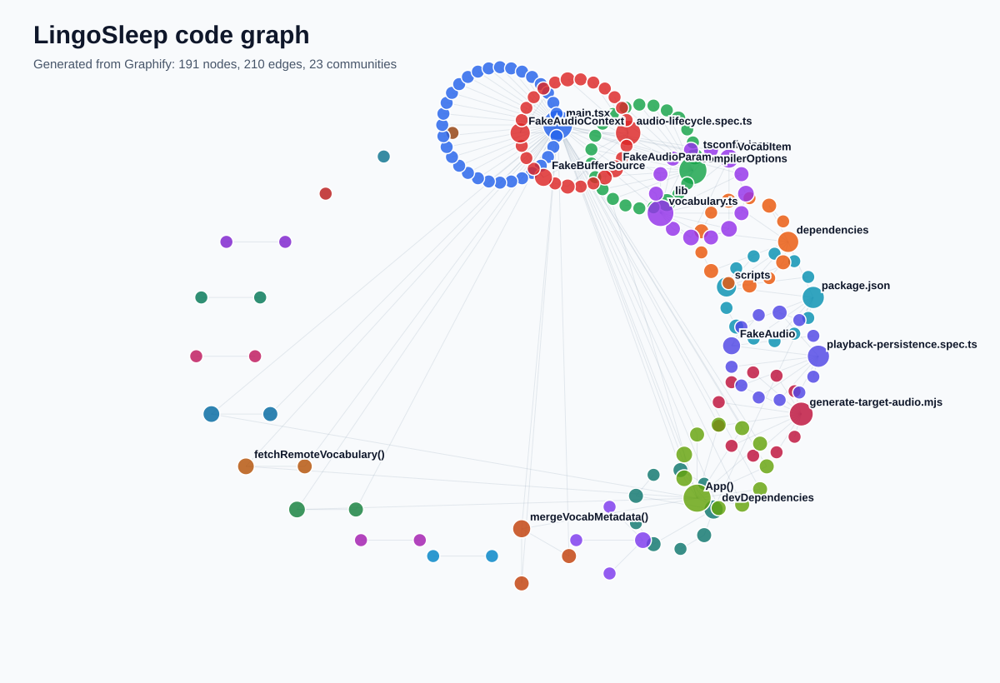

# LingoSleep

**LingoSleep** is a mobile-first nighttime vocabulary review app for Japanese and Korean.

Live deployment: **https://lingosleep.pages.dev**

It is designed for low-friction vocabulary review while resting, commuting, or winding down before sleep. LingoSleep combines target-language audio, native-language meanings, recall pauses, session timers, background sounds, favorites, history, and lightweight progress tracking.

> LingoSleep is a review tool, not a claim that sleep-only learning can produce fluency.

## Highlights

- Japanese and Korean vocabulary review
- English or Simplified Chinese meanings
- Basic, Intermediate, and Advanced levels
- Topic-based filtering
- Multiple playback / recall modes
- Mobile-first player UI
- Separate target-language, native-language, and background-audio volume controls
- Separate language and background timers
- Soft rain, heavy rain, and rain-with-thunder backgrounds
- Gradual language fade near session end
- Favorites, history, familiarity status, and lightweight progress tracking
- Next-session active-recall quiz based on recently reviewed vocabulary
- PWA manifest, service worker, and Media Session metadata for supported mobile browsers and lock screens

## Vocabulary Design

Vocabulary is bundled with the application and organized by language, level, and topic.

The current vocabulary pipeline combines the original level files with several curated expansion sets. Recent work has substantially expanded **Basic**, **Intermediate**, and **Advanced** coverage, with an emphasis on useful standalone lexical items rather than mechanically generated phrase combinations.

Vocabulary quality rules used for the newer expansion sets include:

- Prefer standalone nouns, verbs, adjectives, and established lexical compounds
- Avoid modifier + noun combinatorial filler used only to inflate counts
- De-duplicate Japanese and Korean target headwords against existing vocabulary
- Keep Japanese `reading` as real kana rather than copying the kanji form
- Include Japanese romanization for display and review
- Keep vocabulary distributed across practical topics such as daily life, travel, work, school, food, common verbs, anime/drama, JLPT, and TOPIK

The main vocabulary composition is assembled in `src/vocabulary.ts` from files including:

- `src/vocabulary-basic.ts`
- `src/vocabulary-basic-expansion.ts`
- `src/vocabulary-intermediate.ts`
- `src/vocabulary-intermediate-curated-expansion.ts`
- `src/vocabulary-advanced.ts`
- Additional curated / validated expansion files

Supabase vocabulary rows can also be merged with local metadata where configured.

## Playlist Behavior

LingoSleep no longer limits a filtered playlist to a small fixed 70-word bucket. All unique vocabulary matching the current language, level, and topic can participate in playback.

Random playback uses a shuffle-bag style approach so eligible words are consumed without replacement before a new cycle begins. Recent playback history is also persisted and used to reduce immediate repetition across sessions; recently heard vocabulary is deprioritized when alternatives are available.

This means a larger vocabulary set should translate into genuinely greater listening variety instead of repeatedly cycling through the same small subset.

The same anti-repetition behavior is shared by playlist refresh / shuffle flows rather than resetting to an isolated mini-pool.

## Mobile Player

The player is designed primarily for phones.

Long Japanese and Korean headwords use responsive typography so longer words can remain readable without awkward mid-word wrapping where possible. Japanese entries can display:

- Target text
- Kana reading
- Romanization when available
- Native-language meaning

Empty optional fields are omitted rather than rendering blank labels.

## Run Locally

```bash
npm install
cp .env.example .env.local
npm run dev
```

Set the following variables in `.env.local` when using Supabase-backed features:

```bash
VITE_SUPABASE_URL=...
VITE_SUPABASE_ANON_KEY=...
```

## Build

```bash
npm run build
```

The production build runs TypeScript checks followed by the Vite build.

## Infrastructure

- **Frontend:** React + TypeScript + Vite
- **Hosting:** Cloudflare Pages
- **Backend services:** Supabase Auth, PostgreSQL, Storage, and Row Level Security
- **Testing:** Playwright end-to-end tests

See [DEPLOYMENT.md](./DEPLOYMENT.md) for deployment and environment details.

## Project Structure

- `src/main.tsx` — main application flow, setup, session state, playlist construction, playback, background audio, progress, and quiz behavior
- `src/vocabulary.ts` — vocabulary types and composition of the bundled vocabulary seed
- `src/vocabulary-*.ts` — level-specific and curated vocabulary datasets
- `src/lib/supabase.ts` — browser-side Supabase access
- `supabase/` — database migrations and backend-related configuration
- `tests/e2e/` — Playwright coverage for playback lifecycle, persistence, playlists, and service-worker behavior

## Graphify

The repository includes a generated code graph for exploring the application structure.



Open `graphify-out/graph.html` for the interactive view.

The graph snapshot currently documents the main React application, vocabulary pipeline, playback path, Supabase integration, and end-to-end test coverage. Regenerate it when major structural changes make the checked-in snapshot stale.
